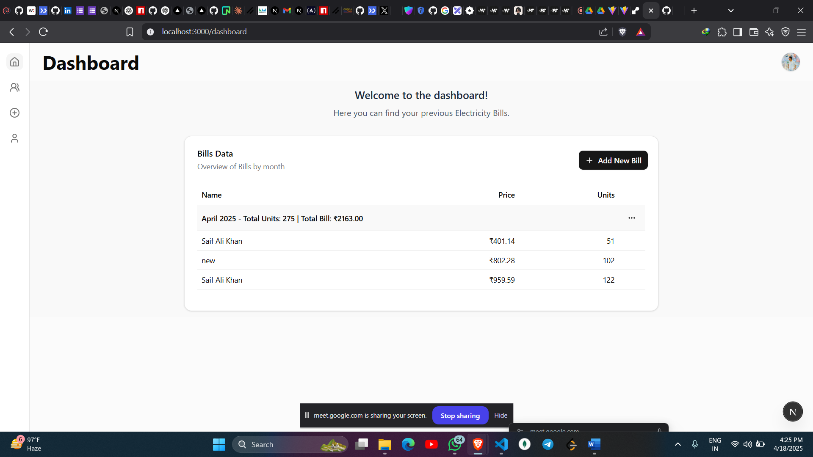

# ⚡️ Bill Splitter App

A smart and simple electricity bill calculator built with **Next.js**, **Tailwind CSS**, and **Prisma**! Perfect for apartments or buildings with shared electricity meters. 🔌💡

---

## 🚀 Features

- 🔢 Input **master meter reading** and individual **flat readings**
- 💸 Calculates each flat’s share of the bill based on consumption
- 🧠 Smart validation (no more over-counting!)
- 📥 Save results to your database
- 🔐 Secure authentication using **NextAuth.js** with credentials provider
- 🎨 Beautiful UI with **Tailwind CSS** and reusable components

---

## 🛠️ Tech Stack

- **Framework**: [Next.js](https://nextjs.org/)
- **Styling**: [Tailwind CSS](https://tailwindcss.com/)
- **Database ORM**: [Prisma](https://www.prisma.io/)
- **Authentication**: [NextAuth.js](https://next-auth.js.org/)
- **Hosting**: (e.g. Vercel, Railway – _your choice!_)

---

## 🧮 How It Works

1. Enter the **master meter reading**
2. Add readings for each **flat**
3. The app:
   - Calculates total usage
   - Determines each flat’s usage
   - Splits the master bill accordingly
4. Click "Save" to persist the result 🔒

---

## 📦 Installation

```bash
git clone https://github.com/saifalikhan9/Bill-Splitter-App.git
cd bill-splitter-app
pnpm install
```

Set up your environment variables (see `.env.sample`):

```env
AUTH_SECRET="" # Added by `npx auth`. Read more: https://cli.authjs.dev

# Google OAuth
GOOGLE_CLIENT_ID=""
GOOGLE_CLIENT_SECRET=""

# Email Configuration
NEXTAUTH_URL="http://localhost:3000"
OWNER_EMAIL="your-owner-email@gmail.com"
OWNER_EMAIL_PASSWORD="your-app-password" 
EMAIL_SERVICE="gmail"

DATABASE_URL="postgresql://neondb_owner:"
```

Then run the app locally:

```bash
pnpm run dev
```

---

## 🧪 Example


---


## 💡 Future Ideas

- 🧾 PDF export of results
-  💬E-mail service intigration
- 📱 Responsive mobile UI

---

## 🙌 Contributing

Pull requests are welcome! For major changes, please open an issue first to discuss what you’d like to change.

---

## 📜 License

[MIT](LICENSE)

---

## 🌟 Acknowledgments

Thanks to the open-source community and tools that made this possible! ❤️
